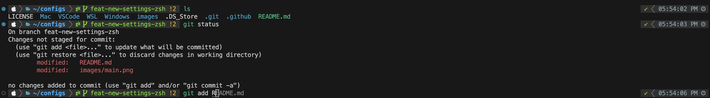

# Neko-nos's dotfiles & configs

These are my settings for a keyboard and fonts in Windows and tools used in programming (VSCode, Git, etc.) across two operating systems: Mac, and Ubuntu (WSL).



## Contents
### Windows
#### Key Configuration
> [!NOTE]
> My configuration is only for JIS layout, a keyboard layout for Japanese. Other layouts are not tested.

There are differences in a key configuration between Mac and Windows, which may confuse you if you use both of them with a default key configuration.<br>
By using my configuration, you can reproduce the Mac key configuration on a Windows computer.

#### Fonts
The default fonts of Windows are, in my humble opinion, not as good as those of Mac, especially for Japanese.<br>
I personally prefer [Moralerspace](https://github.com/yuru7/moralerspace), so I use it in Windows.

### Mac & Ubuntu
#### zsh
1. [zplug](https://github.com/zplug/zplug/tree/master)<br>
   zplug allows you to install useful plugins for zsh.As coded in `.zshrc`, I used plugins for completion, syntax checking, and prompt customization.<br>
   (You can see my prompt in the above image.)

2. [peco](https://github.com/peco/peco)<br>
   There are two functions: `peco-select-history` and `peco-cdr`.<br>
   (The original code is here: https://qiita.com/reireias/items/fd96d67ccf1fdffb24ed)<br>
   As you can see the images in the linked article,<br>
   - `peco-select-history` allows you to view multiple histories and select whay you want.<br>
   - `peco-cdr` allows you to select the directory that you want to move into by using a relative-path, instead of an absolute-path like `peco-select-history`.

3. Useful aliases<br>
   You can see what they do in the `.zshrc` file.

For more details, please refer to the `.zshrc` file.

#### Git
1. Useful settings in `.gitconfig`.<br>
   You can see what they do in the `.gitconfig` file.

2. A template for `.gitignore` (for Python users)<br>
   It includes directories and files such as `.venv` and `__pycache__`.

#### Python
I use [pyenv](https://github.com/pyenv/pyenv) + [Poetry](https://github.com/python-poetry/poetry).

### VScode
1. `linebreak.py`<br>
   If you set the value of `markdown.preview.break` to `true` in `settings.json`, your preview will correcly display line breaks. However, other environments (GitHub, etc) do not automatically generate line breaks.<br>
   It takes time and effort to manually insert line break tags (i.e., `<br>`, two whitespaces and an extra `\n`) every time you write Markdown, especially in Japanese.<br>
   Therefore, I combine [Run on save](https://marketplace.visualstudio.com/items?itemName=pucelle.run-on-save) with `linebreak.py`, that automatically inserts line break tags into your Markdown file.

2. Useful settings for `settings.json`<br>
   It includes not only the settings for VSCode and Python. In `settings_mac.json`, there are also the settings for Markdown and LaTeX.

## Installation

> [!IMPORTANT]
> If you want to use these dotfiles, review and customize the code. **Do not blindly use my settings unless you understand what they do.**<br>
> In fact, some settings are OS-level (e.g., key configurations).

First, clone this repository from GitHub:
```console
git clone https://github.com/zplug/zplug.git $PATH_TO_CONFIGS
```

### Windows
Most of the settings have to be configured via GUI, so there are no install scripts.<br>
Please refer to the `README.md` file in the Windows directory for the installation instruction.<br>
(Since my configuration is for JIS layout (a keyboard layout for Japanese), the `README.md` file is written in Japanese).

### WSL
`WSL/install/install.sh` runs all the install scripts in the `install` directory.
```console
cd $PATH_TO_CONFIGS
cd WSL/install
source install.sh
```
If you want to run a particular script, instead of sourcing `install.sh`, simply execute the desired script.

1. apt.sh<br>
   Update apt and the packages specified in `apt_packages.txt`.<br>
   ```console
   chmod +x apt.sh
   ./apt.sh .
   ```

2. zsh.sh<br>
   Insall [peco](https://github.com/peco/peco), [zplug](https://github.com/zplug/zplug/tree/master) and set up `.zshrc`.<br>
   ```console
   chmod +x zsh.sh
   ./zsh.sh .
   ```

3. git.sh<br>
   Set up `.gitconfig`.<br>
   ```console
   chmod +x git.sh
   ./git.sh .
   ```

4. python.sh<br>
   Install and set up [pyenv](https://github.com/pyenv/pyenv) & [Poetry](https://github.com/python-poetry/poetry)<br>
   ```console
   source python.sh
   ```

### Mac
#### CUI settings
`Mac/install/install.sh` runs all the install scripts in the `install` direcory.
```console
cd $PATH_TO_CONFIGS
cd Mac/install
source install.sh
```
If you want to run a particular script, instead of sourcing `install.sh`, simply execute the desired script.

1. brew.sh<br>
   Install or Update [Homebrew](https://brew.sh/) and the formulae specified in `brew_formulae.txt`<br>
   ```console
   source brew.sh
   ```

2. zsh.sh<br>
   Install [zplug](https://github.com/zplug/zplug/tree/master) and set up `.zshrc`<br>
   ```console
   chmod +x zsh.sh
   ./zsh.sh
   ```

3. python.sh<br>
   Install and set up [pyenv](https://github.com/pyenv/pyenv) & [Poetry](https://github.com/python-poetry/poetry)<br>
   ```console
   source python.sh
   ```

Git configuration files are also provided (they are located in the WSL directory).

#### GUI settings
Since `.zshrc` doesn't support command key configuration, I use [Karabina-elements](https://karabiner-elements.pqrs.org/), an OS-level key configuration tool.<br>
After installing it, open its settings and add the two JSON files (`rule1.json` & `rule2.json`).


### Zsh prompt
#### Prompt with Icons
1. Font Settings<br>
   To display icons using Powerlevel10k, download the `MesloLGS NF` font files from [here](https://github.com/romkatv/powerlevel10k/blob/master/font.md).<br>
   After downloading, set the font in both your terminal and IDE.

2. Configure Powerlevel10k<br>
   Once the font is set, run `p10k configure` to generate a new configuration file.

#### Instant Prompt
Powerlevel10k offers an [instant prompt](https://github.com/romkatv/powerlevel10k/blob/master/README.md#instant-prompt), allowing you to type commands while plugins are still loading.<br>
The instructions in `p10k configure` recommend setting `POWERLEVEL9K_INSTANT_PROMPT` to `verbose`, but if you encounter warnings about the instant prompt, set it to `quiet`.
