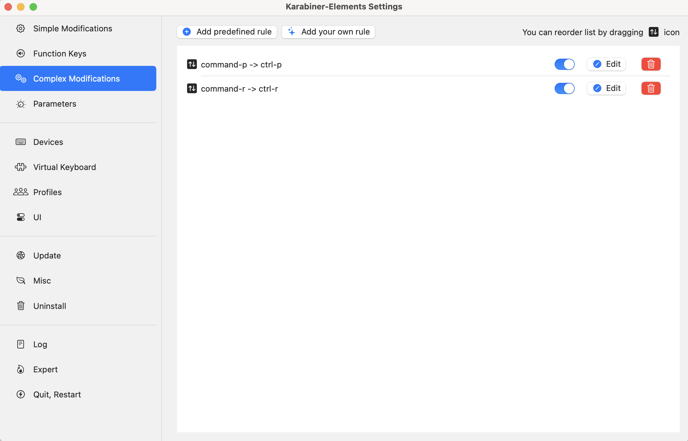

# Neko-nos's configs
<!-- TODO: ctreeの画像を貼る -->
These are my settings for tools used in programming (VSCode, Git, etc.) across two operating systems: Mac, and Ubuntu (WSL) and settings for keyboard in Windows.

## Table of Contents

1. Windows
2. Ubuntu(WSL)
3. Mac
4. VSCode

## Pros

## Installation

> [!IMPORTANT]
> If you want to use these dotfiles, review and customize the code. **Don't blindly use our settings unless you know what the settings do.**
> <br>In fact, some settings are the OS level (key configurations, etc.)

First of all, clone this repository from GitHub:
```console
git clone https://github.com/zplug/zplug.git $PATH_TO_CONFIGS
```

### Windows

### WSL

### Mac
#### CUI settings
`Mac/install/install.sh` runs all the install scripts in the `install` direcory.
```console
cd $PATH_TO_CONFIGS
cd Mac/install
source install.sh
```
If you want to run a particular script, instead of sourcing `install.sh`, simply source the desired script.

1. brew.sh<br>
   Install or Update [Homebrew](https://brew.sh/) and the formulae specified in `brew_formulae.txt`

2. zsh.sh<br>
   Install [zplug](https://github.com/zplug/zplug/tree/master) and set up `.zshrc`

3. python.sh<br>
   Install and set up [pyenv](https://github.com/pyenv/pyenv) & [Poetry](https://github.com/python-poetry/poetry)

Git configuration files are also provided (they are located in the WSL directory).

#### GUI settings
Since `.zshrc` doesn't support command key configuration, we use [Karabina-elements](https://karabiner-elements.pqrs.org/), an OS-level key configuration tool.<br>
After installing it, open its settings and add the two JSON files (`rule1.json` & `rule2.json`).


