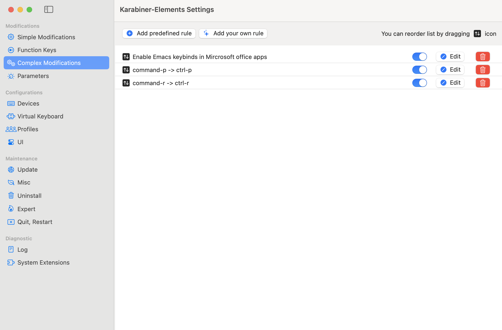
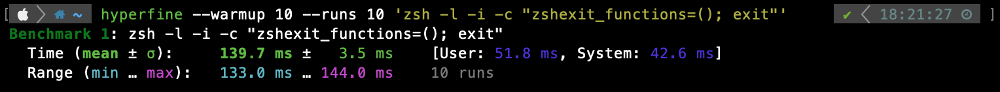

# Neko-nos's dotfiles & configs

Personal configuration files for a consistent development experience across **MacOS** and **Ubuntu (including WSL)**. Includes settings for keyboard layouts (JIS), fonts, command-line tools (Zsh, Git, Codex, Python), and VSCode.

## Feature Highlights

### 1. Mac-like Keyboard Configurations for Windows and Ubuntu
>
> [!NOTE]
> My configuration is tested only for JIS layout, a keyboard layout for Japanese. It may not work as expected on other layouts.

There are differences in keyboard configuration between Mac and Windows/Ubuntu, which may confuse you when switching between systems with a default key configuration.\
By using my configuration, you can make keyboard shortcuts and behaviors on Windows and Ubuntu feel more like MacOS.

### 2. Preferred Fonts

Replaces default system fonts, particularly on Windows, with [Moralerspace](https://github.com/yuru7/moralerspace), a visually appealing font, especially for Japanese characters. Also includes setup for [MesloLGS NF](https://github.com/romkatv/powerlevel10k/blob/master/font.md) for terminal/IDEs.

### 3. Command-Line Environment & Tools

#### Rootless Server Setup

For Linux servers where root privileges are unavailable, [`Server`](./Server)
provides a Bash-based setup that recreates the minimum useful parts of this
repository's Zsh environment. It installs user-local tools such as `uv`,
`gdown`, and `shellcheck`, links Bash configuration, and sets up server-side
nano settings without `sudo`. See [Server/README.md](./Server/README.md) for details.

#### Enhanced Command-Line Environment (Zsh)

- **Plugin Management with [sheldon](https://github.com/rossmacarthur/sheldon)**\
  Sheldon allows you to install useful plugins for zsh and it is fast. The `.zshrc` includes plugins for auto-completion, syntax highlighting, and prompt customization.\

- **Efficient Navigation with filter tools (e.g., [fzf](https://github.com/junegunn/fzf))**\
  There are useful functions using filter tools such as `search-history` and `search-cdr`.\
  - `search-history` allows you to search and select commands from multiple histories interactively.
  - `search-cdr` allows you to select the directory that you want to move into by using a relative path, instead of an absolute path like `search-history`.

- **Smart History Management**\
  Prevents failed commands from being saved to `.zsh_history` while enabling `inc_append_history` and `extended_history`. Failed commands remain in memory, so you can still recall and correct them via arrow keys in the session.\
  Furthermore, the implementation uses only the Python standard libraries, so it works with the system Python without requiring additional environment setup.

- **Safe History Editing with Normal Editors**\
  zsh assigns special roles to certain bytes and manages `.zsh_history` using ([`metafy`](https://github.com/zsh-users/zsh/blob/zsh-5.9/Src/utils.c#L4764) and [`unmetafy`](https://github.com/zsh-users/zsh/blob/zsh-5.9/Src/utils.c#L4862)). If you edit it directly with a normal editor, these processes are not taken into account, producing invalid bytes.\
  `zsh-history-edit` lets you edit `.zsh_history` with a normal editor without corrupting Japanese text or other multibyte characters.

- **Useful settings, aliases and functions**\
  Please refer to `.zshrc` file for details.

For more details, please refer to the files in `common/zsh`.

#### Git

- **Useful settings in `.gitconfig`**\
  Please refer to `.gitconfig` file for details.

- **A template for `.gitignore` (for Python users)**\
  A `.gitignore` tailored for Python projects, ignoring common files/directories like `.venv`, `__pycache__`, etc.

#### nano

- **GNU nano settings from a custom repository**\
  The installer links system nano syntax files into `~/.config/nano/syntax` and links `~/.nanorc` to `~/nanorc/.nanorc`.
  It also links custom syntax files from `~/nanorc/syntax`.
  If `~/nanorc` does not exist, the installer asks whether to clone [Neko-nos/nanorc](https://github.com/Neko-nos/nanorc.git), our custom nanorc files inspired by VSCode Dark Modern Theme, there first.

#### Coding Agents

- **Codex and Claude Code setup**\
  Installs the CLI tools and links the shared agent settings into each tool's configuration directory with symbolic links.

#### Python Environment Management

Provides setup scripts for your choice of modern Python environment tools:\

- **[uv](https://github.com/astral-sh/uv):** An extremely fast Python package and project manager.
- **[pyenv](https://github.com/pyenv/pyenv) + [Poetry](https://github.com/python-poetry/poetry):** Classic combination for managing Python versions (pyenv) and project dependencies/packaging (Poetry).

### 4. VSCode Settings & Customizations

- **Automatic Line Breaks for Markdown with `linebreak.py`**\
  Addresses the common issue where Markdown previews (`markdown.preview.break: true`) show line breaks correctly in VSCode, but standard Markdown renderers like GitHub require explicit hard breaks.\
  It is tedious to append a trailing backslash manually every time you write Markdown, especially in Japanese.\
  This script, used with the [Run on save](https://marketplace.visualstudio.com/items?itemName=pucelle.run-on-save) extension, automatically inserts trailing backslashes into your Markdown file.

- **Curated `settings.json`**\
  Includes not only useful settings for general VSCode usage, Python development, but also specific settings for Markdown and LaTeX (in `settings_mac.json`).

### 5. GPU-Enabled Codex Containers

[The open Codex issue](https://github.com/openai/codex/issues/3141)
reports that the Linux sandbox prevents access to NVIDIA GPUs. Until sandboxed
GPU access is supported, Codex must run with full access to use the GPU.

This repository offers containers to limit that full-access environment:

- **Docker support:** [`common/install/docker.sh`](./common/install/docker.sh)
  installs Docker Engine and NVIDIA Container Toolkit.
- **WSL configuration:** [`WSL/wsl.conf`](./WSL/wsl.conf) enables systemd and
  GPU support while disabling Windows drive automounting and interoperability.
  This keeps the Docker host focused on Linux resources and reduces access to
  the Windows environment.
- **Codex CLI container:** [`common/codex/Dockerfile`](./common/codex/Dockerfile)
  creates a custom container inherited from `nvidia/cuda:12.8.0-devel-ubuntu24.04`.
- **Codex IDE Dev Container:**
  [`VSCode/devcontainer.json`](./VSCode/devcontainer.json) opens any project using the
  above container from VS Code. Select full access in the
  Codex IDE extension after entering the container.

## Installation

> [!IMPORTANT]
> If you want to use these dotfiles, review and customize the code. **Do not blindly use my settings unless you understand what they do.**\
> In fact, some settings are system-level (e.g., key configurations).

First, clone this repository from GitHub:

```console
git clone https://github.com/Neko-nos/configs.git
```

### Configurations for Keyboard

#### Windows

Most of the settings have to be configured via GUI, so there are no install scripts.\
Please refer to the `README.md` file in the Windows directory for the installation instructions.\
(Since my configuration is for JIS layout (a keyboard layout for Japanese), the `README.md` file is written in Japanese).

#### Ubuntu

Some settings require GUI, so there are no install scripts.\
Please refer to the `README.md` file in the Ubuntu directory for the installation instructions and what the scripts in `Ubuntu/keyboard` do.

#### Mac

Since `.zshrc` doesn't support command key configuration, I use [Karabiner-elements](https://karabiner-elements.pqrs.org/), a system-level key configuration tool.\
After installing it, open its settings and add the JSON files in `karabiner_elements`.



### Command-Line Environment & Tools

There are install scripts for Mac, Ubuntu and WSL in the `install` directory of each system.\
`install/install.sh` runs all the install scripts including those in the `common/install` directory. Git, GitHub CLI, GitHub SSH, nano, Codex, Claude Code, Python, and markdownlint setups are optional and prompted interactively.

```console
chmod +x install.sh
./install.sh
```

If you want to run a particular script, instead of executing `install.sh`, simply execute the desired script.

1. apt/brew.sh\
   Update apt/brew and the packages specified in `apt_packages.txt` or `brew_formulae.txt`.

   ```console
   cd <Mac/Ubuntu/WSL>/install
   source apt/brew.sh
   ```

2. zsh.sh\
   Install [sheldon](https://github.com/rossmacarthur/sheldon) and set up `.zshrc`.

   ```console
   cd common/install
   source zsh.sh <Mac/Ubuntu/WSL>
   ```

3. git.sh\
   Set up `.gitconfig`.

   ```console
   cd common/install
   source git.sh
   ```

4. gh.sh\
   Install [GitHub CLI](https://cli.github.com/) on Ubuntu or WSL from the official GitHub CLI apt repository. On Mac, `gh` is installed by `brew.sh` from `brew_formulae.txt`.

   ```console
   cd <Ubuntu/WSL>/install
   source gh.sh
   ```

5. github_ssh.sh\
   Set up SSH authentication for GitHub. The script generates or reuses an Ed25519 SSH key, adds it to the ssh-agent, uploads the public key with `gh` when available, and tests `ssh -T git@github.com`.

   ```console
   cd common/install
   source github_ssh.sh
   ```

6. nano.sh\
   Set up nano with system syntax definitions and optional custom settings from `~/nanorc`.
   On Mac, install the Homebrew `nano` formula first so the `nano` command resolves to the Homebrew version instead of the system Pico-compatible editor.

   ```console
   cd common/install
   source nano.sh
   ```

7. docker.sh\
   Install Docker Engine, and optionally install NVIDIA Container Toolkit for GPU containers.

   ```console
   cd common/install
   source docker.sh
   ```

8. wsl.sh\
   On WSL, set up `/etc/wsl.conf` for systemd, GPU support, and reduced Windows interop.

   ```console
   cd WSL/install
   source wsl.sh
   ```

9. codex.sh\
   Install Codex CLI and set up Codex configuration links in `$CODEX_HOME` (default: `~/.codex`).

   ```console
   cd <Mac/Ubuntu/WSL>/install
   source codex.sh
   ```

10. claude.sh\
    Install Claude Code when needed and set up configuration links in `$CLAUDE_HOME` (default: `~/.claude`).

    ```console
    cd common/install
    source claude.sh
    ```

11. python.sh\
    Install and set up [uv](https://github.com/astral-sh/uv) or [pyenv](https://github.com/pyenv/pyenv) & [Poetry](https://github.com/python-poetry/poetry)

    ```console
    cd common/install
    source python.sh
    ```

12. markdownlint.sh\
    Install [markdownlint-cli2](https://github.com/DavidAnson/markdownlint-cli2) with Homebrew on Mac or npm on Ubuntu and WSL.

    ```console
    cd <Mac/Ubuntu/WSL>/install
    source markdownlint.sh
    ```

13. actionlint.sh\
    Install [actionlint](https://github.com/rhysd/actionlint) with Homebrew on Mac or the official prebuilt binary installer on Ubuntu and WSL.

    ```console
    cd <Mac/Ubuntu/WSL>/install
    source actionlint.sh
    ```

### Zsh prompt

#### Prompt with Icons

1. Font Settings\
   To display icons using Powerlevel10k, download the [`MesloLGS NF` font files](https://github.com/romkatv/powerlevel10k/blob/master/font.md).\
   After downloading, set the font in both your terminal and IDE.\
   On Mac with the default `Terminal.app`, import [`Mac/default_terminal_profile.terminal`](./Mac/default_terminal_profile.terminal) from `Terminal > Settings > Profiles > Action > Import...` and use that profile.

2. Configure Powerlevel10k\
   Once the font is set, run `p10k configure` to generate a new configuration file.

#### Instant Prompt

Powerlevel10k offers an [instant prompt](https://github.com/romkatv/powerlevel10k/blob/master/README.md#instant-prompt), allowing you to type commands while plugins are still loading.\
The instructions in `p10k configure` recommend setting `POWERLEVEL9K_INSTANT_PROMPT` to `verbose`, but if you encounter warnings about the instant prompt, set it to `quiet`.

### Development Setup

If you are going to contribute to this repository, install the development dependencies before you start working:

```console
uv sync
uv run prek install
```

Without these steps, the hooks may not run at commit or push time, or they may fail because `prek` is not available.\
The actionlint hook also requires the `actionlint` command. Install it with `<Mac/Ubuntu/WSL>/install/actionlint.sh` if it is missing.\
The `pre-push` hook benchmarks Zsh startup time with [hyperfine](https://github.com/sharkdp/hyperfine) before pushing.\
GitHub Actions also benchmarks Zsh startup time on pull requests by comparing the base and head revisions on the same runner, and it publishes benchmark history for pushes to `main`.

## Benchmark Results

The published benchmark history is available here:\
[Zsh startup benchmark history](https://neko-nos.github.io/configs/dev/bench/zsh-startup/)

> [!NOTE]
> The published benchmark history and benchmark results shown on pull requests are measured on GitHub Actions runners, so they might be slower than the results on your local machine.\
> As a local reference, on a Mac with Apple M2 and 16 GB memory, `zsh -l -i -c "zshexit_functions=(); exit"` takes about 139.7 ms in this repository.


