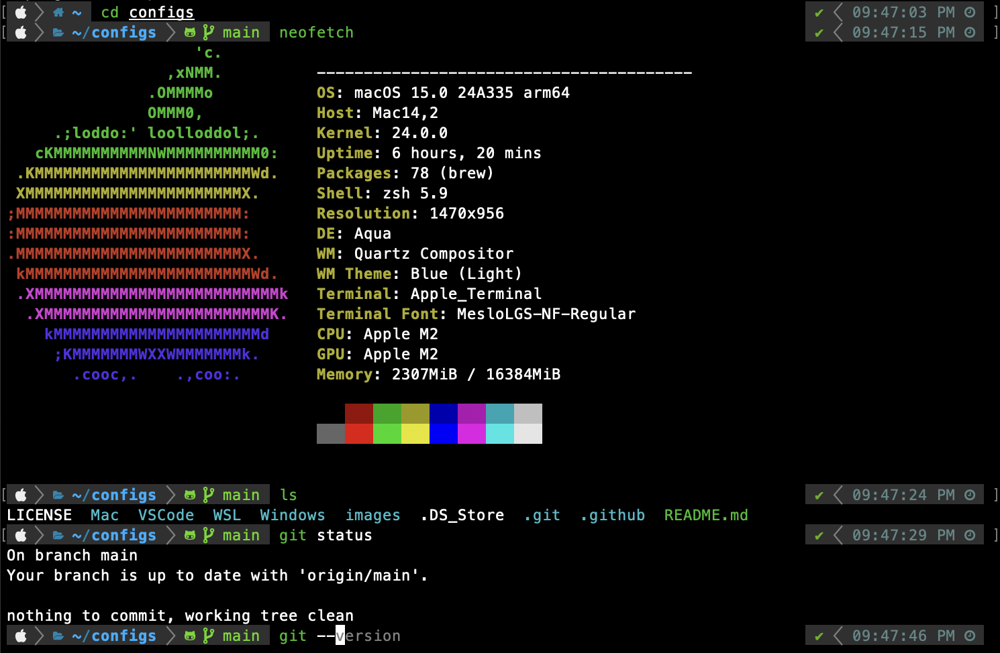

# Neko-nos's dotfiles & configs


Personal configuration files for a consistent development experience across **MacOS** and **Ubuntu (including WSL)**. Includes settings for keyboard layouts (JIS), fonts, command-line tools (Zsh, Git, Python), and VSCode.

## Core Philosophy

The main goal is to replicate a Mac-like keyboard experience on Windows and Ubuntu (specifically for JIS layout) and establish a comfortable and efficient command-line and coding environment using preferred tools and fonts.

## Feature Highlights
### 1. Mac-like Key Configurations for Windows and Ubuntu
> [!NOTE]
> My configuration is tested only for JIS layout, a keyboard layout for Japanese. It may not work as expected on other layouts.

There are differences in a key configuration between Mac and Windows/Ubuntu, which may confuse you when switching between systems with a default key configuration.<br>
By using my configuration, you can make keyboard shortcuts and behaviors on Windows and Ubuntu feel more like MacOS.

### 2. Preferred Fonts
Replaces default system fonts, particularly on Windows, with [Moralerspace](https://github.com/yuru7/moralerspace), a visually appealing font, especially for Japanese characters. Also includes setup for [MesloLGS NF](https://github.com/romkatv/powerlevel10k/blob/master/font.md) for a terminal/IDE.

### 3. Command-Line Environment & Tools
#### Enhanced Command-Line Environment (Zsh)
- **Plugin Management with [zplug](https://github.com/zplug/zplug/tree/master)**<br>
  zplug allows you to install useful plugins for zsh. The `.zshrc` includes plugins for auto-completion, syntax highlighting, and prompt customization.<br>
  (You can see the prompt in the above image.)

- **Efficient Navigation with [peco](https://github.com/peco/peco)**<br>
  There are two functions using `peco`: `peco-select-history` and `peco-cdr`.<br>
  (The original code is here: https://qiita.com/reireias/items/fd96d67ccf1fdffb24ed)<br>
  As you can see in the images in the linked article,<br>
  - `peco-select-history` allows you to search and select commands from multiple histories interactively.
  - `peco-cdr` allows you to select the directory that you want to move into by using a relative-path, instead of an absolute-path like `peco-select-history`.

- **Useful settings, aliases and functions**<br>
  You can see what they do in the `.zshrc` file.

For more details, please refer to the `.zshrc` file.

#### Git
- **Useful settings in `.gitconfig`**<br>
  You can see what they do in the `.gitconfig` file.

- **A template for `.gitignore` (for Python users)**<br>
  A `.gitignore` tailored for Python projects, ignoring common files/directories like `.venv`, `__pycache__`, etc.

#### Python Environment Management
Provides setup scripts for your choice of modern Python environment tools:<br>
- **[uv](https://github.com/astral-sh/uv):** An extremely fast Python package and project manager.
- **[pyenv](https://github.com/pyenv/pyenv) + [Poetry](https://github.com/python-poetry/poetry):** Classic combination for managing Python versions (pyenv) and project dependencies/packaging (Poetry).

### VSCode Settings & Customizations
- **Automatic Line Breaks for Markdown with `linebreak.py`**<br>
  Addresses the common issue where Markdown previews (`markdown.preview.break: true`) show line breaks correctly in VSCode, but standard Markdown renderers (like GitHub) require explicit breaks (`<br>` or two spaces).<br>
  It takes time and effort to manually insert line break tags (i.e., `<br>`, two whitespaces and an extra `\n`) every time you write Markdown, especially in Japanese.<br>
  This script, used with [Run on save](https://marketplace.visualstudio.com/items?itemName=pucelle.run-on-save) extension, automatically inserts line break tags into your Markdown file.

- **Curated `settings.json`**<br>
  Includes not only useful settings for general VSCode usage, Python development, but also specific settings for Markdown and LaTeX (in `settings_mac.json`).

## Installation

> [!IMPORTANT]
> If you want to use these dotfiles, review and customize the code. **Do not blindly use my settings unless you understand what they do.**<br>
> In fact, some settings are system-level (e.g., key configurations).

First, clone this repository from GitHub:
```console
git clone https://github.com/Neko-nos/configs.git
```

### Key Configurations
#### Windows
Most of the settings have to be configured via GUI, so there are no install scripts.<br>
Please refer to the `README.md` file in the Windows directory for the installation instructions.<br>
(Since my configuration is for JIS layout (a keyboard layout for Japanese), the `README.md` file is written in Japanese).

#### Ubuntu
Some settings require GUI, so there are no install scripts.<br>
Please refer to the `README.md` file in the Ubuntu directory for the installation instructions and what the scripts in `Ubuntu/keyboard` do.

#### Mac
Since `.zshrc` doesn't support command key configuration, I use [Karabiner-elements](https://karabiner-elements.pqrs.org/), a system-level key configuration tool.<br>
After installing it, open its settings and add the two JSON files (`rule1.json` & `rule2.json`).


### Command-Line Environment & Tools
There are install scripts for Mac, Ubuntu and WSL in the `install` directory of each system.<br>
`install/install.sh` runs all the install scripts in the `install` directory.
```console
cd install
chmod +x install.sh
./install.sh
```
If you want to run a particular script, instead of executing `install.sh`, simply execute the desired script.

1. apt.sh<br>
   Update apt and the packages specified in `apt_packages.txt`.
   ```console
   chmod +x apt.sh
   ./apt.sh .
   ```

2. zsh.sh<br>
   Install [peco](https://github.com/peco/peco), [zplug](https://github.com/zplug/zplug/tree/master) and set up `.zshrc`.
   ```console
   chmod +x zsh.sh
   ./zsh.sh
   ```

3. git.sh<br>
   Set up `.gitconfig`.
   ```console
   chmod +x git.sh
   ./git.sh
   ```

4. python.sh<br>
   Install and set up [uv](https://github.com/astral-sh/uv) or [pyenv](https://github.com/pyenv/pyenv) & [Poetry](https://github.com/python-poetry/poetry)
   ```console
   chmod +x python.sh
   ./python.sh
   ```

### Zsh prompt
#### Prompt with Icons
1. Font Settings<br>
   To display icons using Powerlevel10k, download the `MesloLGS NF` font files from [here](https://github.com/romkatv/powerlevel10k/blob/master/font.md).<br>
   After downloading, set the font in both your terminal and IDE.

2. Configure Powerlevel10k<br>
   Once the font is set, run `p10k configure` to generate a new configuration file.

#### Instant Prompt
Powerlevel10k offers an [instant prompt](https://github.com/romkatv/powerlevel10k/blob/master/README.md#instant-prompt), allowing you to type commands while plugins are still loading.<br>
The instructions in `p10k configure` recommend setting `POWERLEVEL9K_INSTANT_PROMPT` to `verbose`, but if you encounter warnings about the instant prompt, set it to `quiet`.
