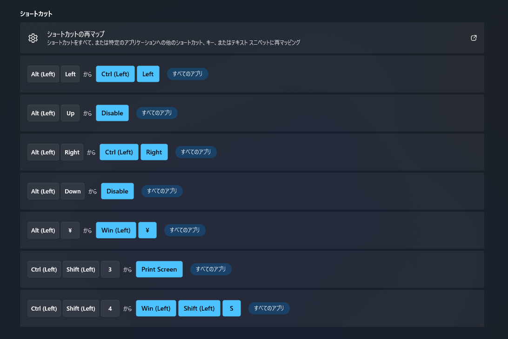

# Windows側の設定
## マウス
Macと同じ方向にしたいのでレジストリエディタで以下の記事を参考に変更した 
https://qiita.com/purple_jp/items/bea04765c04a7c0d715c

## キーボード
Windows11では明るさを変えることができず、ファンクションキーもMacと同じことにすることはできないのでそこは諦めた 
代わりにNVIDIA Control Panelから変えることができるのでそこから変更していく
### Windows側から変えられること
まず、最新のIMEではカスタマイズが不可能になったので昔のversionのIMEに変更する 
(Windowsの設定で日本語IMEから設定可能) 
その後、IMEのプロパティを開いて詳細設定からキー設定を変更していく

1. 無変換/変換をMacの様にする 
まずはデフォルトでは切り替えるだけで画面中央に表示が出るのでオフにする(最初の設定画面に書いてある) 
無変換ではIME-オフ、全確定、全確定として、変換ではIME-オンとする

2. 半角全角キーの削除 
間違って押すと面倒だしそもそも便利な場面がないので、IME側の設定から無効とする 
(後述するが、日本語IMEでのバグによって仮想キーと判定されるキーは一度押すと、押した判定がずっと残ってしまうのでショートカットキーの機能を持つキーに変えてはならない)

### Power toys
以下の記事通りにPower toysをinstallした 
https://www.monoists.com/entry/change-key-mapping-in-windows 
目標としてはMacと同じキーボード操作を実現することであるが、いくつか問題点が存在する

1. Windowsで日本語キーボードを使う際に、CAPSキーが仮想キーVK240となってしまう 
IME側のバグによって仮想キーは一度押すと、固定キーモードの様にそのキーを押し続けていると認識してしまうので、 
ショートカットの最初にあるキーを登録すると、再起動しない限りショートカットしか使えなくなる 
https://github.com/microsoft/PowerToys/issues/3397#issuecomment-1211622583

2. 1の結果JIS配列ではMacの様なctrl a, ctrl eがPower toysだけでは不可能になってしまう 
(設定についてはKeyboard Managerを参照のこと)

### ChangeKey
以下の記事を参考にバグを引き起こす仮想キーについてはChangeKey側で変更し、ショートカットはAutoHotkeyに任せることにした 
https://qiita.com/kerupani129/items/d7894dbf789758f05e12#2-autohotkey 
ちなみに、ChangeKeyはレジストリ側を変更しているので上記のWindows側のバグも乗り越えられるが、Power toys側では何故かバグが残ってしまった

### AutoHotkey
以下の記事を参照してinstallした 
https://future-architect.github.io/articles/20230216a/ 
https://www.autohotkey.com/ 
https://github.com/AutoHotkey/AutoHotkey 
win2mac.ahkにコードを書いて、起動後に自動で実行してくれるように設定もした 
https://atmarkit.itmedia.co.jp/ait/articles/1701/18/news029.html

### Capslock
1. キーボードにある元々のCapslockキーは上記の通りChangeKeyで変える必要がある
2. Logicoolのマウスを使っていてLogi Options+というアプリを入れていたが、これのデフォルト設定でCapslockのオンオフが画面に出るようになっている
そこで、Logi Options+の設定からその機能をオフにすればよい 
https://chocogon.com/numlock_onscreen/

## クリップボード
1. Macでのclipyに相当するものが欲しかったのでcliborを以下の記事通りにinstallして設定した 
https://chigusa-web.com/clibor/download/ 
https://qiita.com/yukihiro-toda/items/03b44dd2c24d888cd2b7

2. 設定画面からスタート時に起動するようにした
3. キーボードをかなり変えていてデフォルトの設定だと変になるので、自動貼り付けを無効にした

# VScode
## 本体の設定
基本的な設定はMacの方と同じようにUsers側のsettings.jsonを編集した

## フォント
まず、Macぐらい綺麗なフォントをWindowsで見せるのは難しい 
そうはいってもデフォルトの日本語表示が個人的に見辛いので、Moralerspace Neonを使うことにし、settings.jsonのfontFamilyを編集した 
(Windowsでフォントをinstallする際には何故か設定のほうからはできなかったので、フォントビュワーからinstallした) 
https://github.com/yuru7/moralerspace
