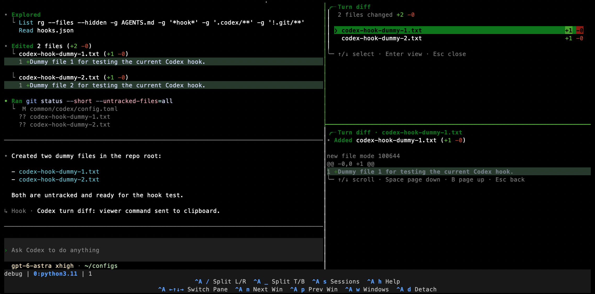

# Codex Tools and Configuration

This setup helps you review Codex's file changes, use your preferred working
style, and run development tasks in Ubuntu or macOS environments.

## Review changes after each request

The turn-diff viewer lets you check what changed in a turn. It lists the affected files, and  lets you open a colored diff for each file.



### Keep recent reviews

When you submit a new CLI request, saved reviews for sessions with no updates
in the past 30 days are automatically removed from that repository.

To change the period, edit `--retention-days 30` in the `UserPromptSubmit` hook command in [hooks.json](./hooks.json).

## Rules

[Rules](./rules) preapprove selected safe commands to reduce the automatic
approval reviewer's token usage.

## Ubuntu containers

Use the [Ubuntu](./containers/ubuntu) or [GPU](./containers/ubuntu-gpu) template
when Codex needs full access. Copy its files into your project's `.devcontainer/`
to use it with VSCode Dev Containers.

## macOS VM

Run macOS tasks, including GUI operations, in a [VM](./vms/macos) to protect
your host machine. The supplied [operate-tart-vm skill](./skills/operate-tart-vm/SKILL.md)
makes it easier to use the VM from Codex.

## SQLite logging

[Disable diagnostic logging](./disable_sqlite_logging.py) to reduce disk writes.
Start Codex once, quit all Codex processes, then run:

```console
python3 ~/configs/common/codex/disable_sqlite_logging.py \
    "${CODEX_SQLITE_HOME:-${CODEX_HOME:-$HOME/.codex}}/logs_2.sqlite"
```
